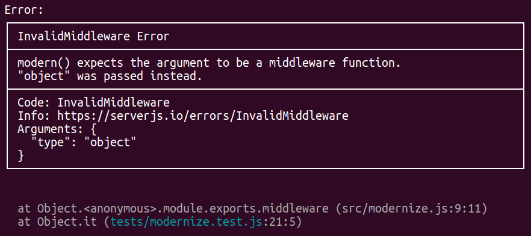
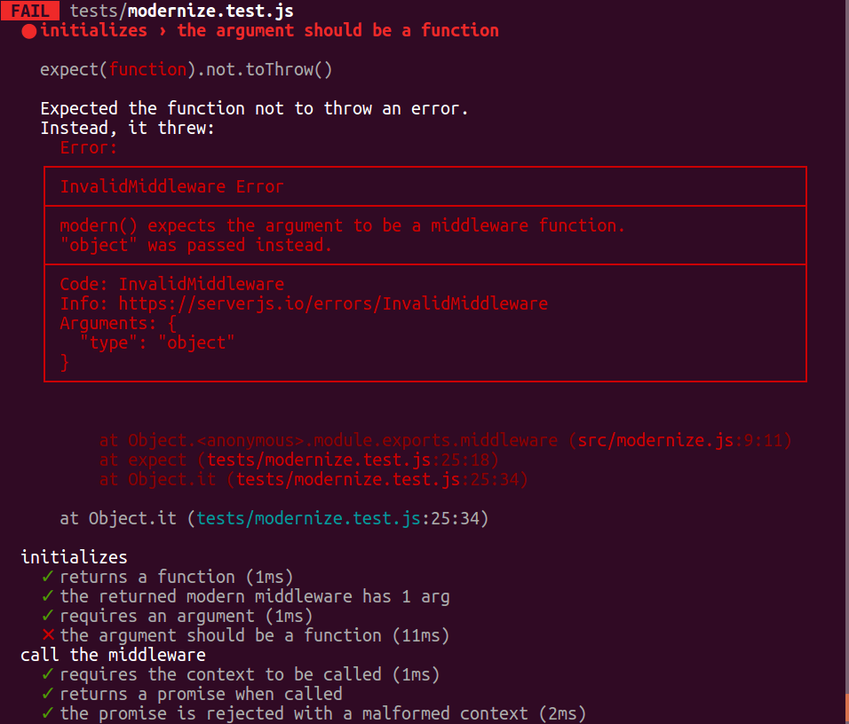

# human-error

Good errors for people to read:

| [](img/error_full.png)  | [](img/jest.png)
|:---:|:---:|
| An error while running with `node app.js` | Same error within testing context of `jest` |


## Getting started

Install it with NPM:

```bash
npm install human-error --save
```

Then create your error codes:

```js
// myfun-errors.js
const errors = require('human-error')({
  // [optional] a url where the error is explained in-depth
  url: name => `http://example.com/error/${name}`
});

errors.MissingCallback = () => `
  myFun() expects a callback to be passed but nothing was passed.
`;

errors.InvalidCallback = ({ type }) => `
  myFun() expects the argument to be a callback function.
  ${type ? `"${type}" was passed instead.` : ''}
`;

module.exports = errors;
```

Then use them in your code:

```js
// myfun.js
const errors = require('./myfun-errors');

module.exports = (cb) => {
  if (!cb) {
    throw new errors.MissingCallback();
  }
  if (!(cb instanceof Function)) {
    throw new errors.InvalidCallback({ type: typeof cb });
  }
  cb('Cool library!');
};
```


## Options

- `url` [false]: if there's an url to show more info. It can be a string in which case it will just be printed or a function that build the error such as `(key) => 'https://example.com/errors#' + key` so you can show the appropriate support url.
- `width` [80]: the width of the row
